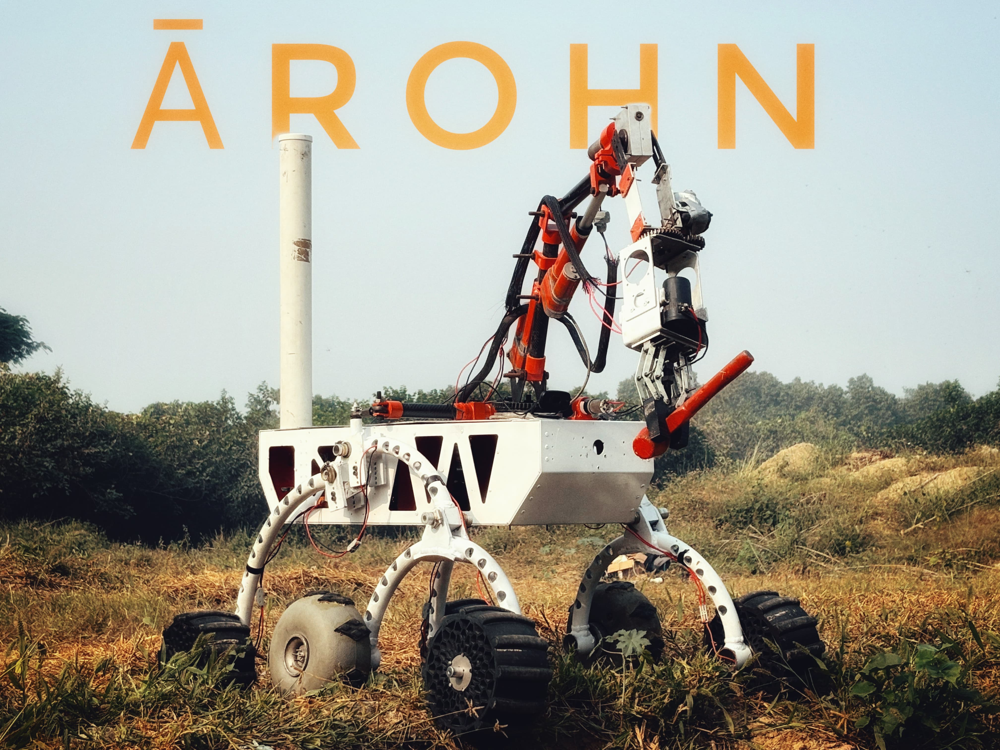

# Arohn – Mars Rover Prototype

**Arohn** is a robust, modular Mars rover prototype designed for planetary exploration and research simulations. Built for the extreme, Arohn combines autonomy, teleoperation, and scientific analysis into a single system capable of tackling rugged environments and remote operations.



## Features

- **Fully Autonomous Traversal**  
  Navigate and explore unknown terrains without human intervention.

- **Astrobiology Tasks**  
  Perform key scientific experiments like:
  - Sample collection
  - Surface soil analysis

- **Teleoperation (up to 1 km LOS)**  
  Seamless manual control with real-time video and telemetry up to 1 km line-of-sight.

- **6-Wheel Rocker-Bogie Suspension**  
  Mechanically stable design enabling traversal over uneven, rocky surfaces.

- **6-DOF Manipulator Arm**  
  Perform delicate or complex interactions like grabbing, rotating, or analyzing samples.

- **Modular Helper Functions**  
  Includes an extensive suite of utilities to aid in rover control, perception, and mission management.

- **Custom GUI Dashboard**  
  A streamlined interface to:
  - View and manage multiple camera feeds
  - Monitor sensor data and odometry in real time

## Repository Structure

This repository includes:
- Core rover software (navigation, manipulation, teleop)
- GUI dashboard
- Sensor integration scripts
- Helper utilities for common rover tasks

## Prerequisites

Before cloning and using this repository, ensure the following:

1. Install **[ROS Noetic (ROS1)](http://wiki.ros.org/noetic/Installation/Ubuntu)**
2. Clone the software stack:
   ```bash
   git clone https://github.com/pratham965/ArohnSoftwareStack.git
   ```
